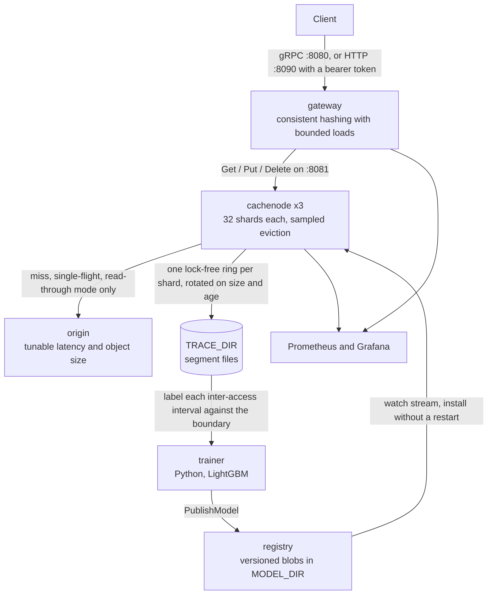

# Belady

A distributed cache whose eviction policy is a machine-learned approximation of the provably optimal algorithm.

Belady's MIN (1966) is the optimal cache eviction policy: evict the object whose next access is furthest in the future.
It is also unimplementable, because it requires seeing the future.
Every production cache therefore falls back on a heuristic, almost always LRU, and stops asking the question.

Belady asks it again.
A gradient-boosted decision tree, trained on sampled access traces, predicts whether an object's next access falls beyond a *Belady boundary*.
Eviction samples a handful of candidates, scores them with that model, and drops the worst.
The technique is [Learned Relaxed Belady](https://www.usenix.org/conference/nsdi20/presentation/song) (NSDI 2020), well known in CDN research and essentially unknown in mainstream backend engineering.

Because the model runs inside the eviction path, it has a hard sub-microsecond budget.
That constraint is the point: it forces flattened cache-friendly tree layouts, sharded locking, zero-allocation request handling, and lock-free trace sampling.

## What it does

The full loop works.
The cluster serves traffic, samples access traces, trains a model from them, publishes it, and the cache nodes install it without a restart.
It runs under Docker Compose with Prometheus and Grafana, and CI covers build, race tests, lint, generated-code drift, vulnerability scanning, and a Compose integration run gated on hit ratio and p99.

There are two serving modes, and a node logs which one it is at startup.
With `ORIGIN_ADDR` set a node is read-through: a miss fetches from origin behind single-flight, admits the result, and returns it.
Without it the node is cache-aside, and a miss is simply not found, leaving the client to decide what to do.

It is not a Redis replacement and does not try to be: no data types beyond bytes, no persistence, no replication, no pub/sub.
What it is is a cache tier, and the small stack around it makes that usable.
The reasoning is written up in [docs/](docs/), including nine decision records, and the open questions are in [ROADMAP.md](ROADMAP.md).

## Tech stack

| Layer | What it uses |
| --- | --- |
| Services | Go 1.26, four binaries under `cmd/` |
| Internal APIs | gRPC and protobuf, contracts in `api/belady/v1/`, stubs committed under `gen/` |
| Trainer | Python 3.11+, LightGBM, numpy |
| Metrics | `prometheus/client_golang`, scraped by Prometheus, dashboards in Grafana |
| Concurrency | `golang.org/x/sync` for single-flight, plus per-shard locks and atomics |
| Deploy | Docker Compose, three stack files under `deploy/` |
| Checks | `go test -race`, golangci-lint with gosec, ruff, pytest, CodeQL, pip-audit |

Four direct Go requires, four Python ones.
`grpcio-tools` and `ruff` are pinned exactly rather than floated, because both produce artefacts CI compares byte for byte and a minor bump would fail the build for no real reason.

## Architecture

| Service | Language | Role |
| --- | --- | --- |
| `gateway` | Go | Client-facing gRPC API, consistent-hash routing, miss coalescing |
| `cachenode` | Go | Sharded store, learned eviction, trace sampling, hot model reload |
| `registry` | Go | Versioned model blobs, streamed to cache nodes |
| `trainer` | Python | Offline labeling and LightGBM training |
| `origin` | Go | Test-fixture backing store |



That cycle is the whole project.
A `Get` hashes to a node through the ring, the node answers from its shard or fetches from origin behind single-flight, and the access is appended to its shard's lock-free ring, which never slows a request: if the ring is full the record is dropped and counted in `belady_cache_trace_dropped_total`.
The trainer reads the rotated segment files offline, labels each sampled interval against the Belady boundary, fits a LightGBM model, and pushes it to the registry, where a watch stream carries it back to every node and the new model takes over eviction mid-flight.
Nothing in that loop is on the request path except the eviction scoring itself, which is why the registry being down means nodes keep evicting with the model they already have rather than failing.

Topology, the request path, where state lives, and the failure table are in [docs/01-architecture.md](docs/01-architecture.md).

## Measured results

Three cache nodes, 32 shards each, 6 MiB per node, Zipfian s=1.1 over 50,000 keys, 400,000 requests at concurrency 64, 4 KiB mean object, 200 µs origin latency, Apple M4.
Each policy starts cold. The model is a 31-tree LightGBM fit on 217,283 rows sampled from an 8.5 s trace of the same workload, holdout AUC 0.985.

| Policy | Object hit | Byte hit | Gap to Belady MIN | Evict cost | p99 | p99.9 |
| --- | --- | --- | --- | --- | --- | --- |
| LRU (sampled, 8) | 0.8732 | 0.8645 | -6.96 pts | 815 ns/victim | 3.31 ms | 4.55 ms |
| Learned (LRB) | **0.8794** | **0.8705** | **-6.33 pts** | 8548 ns/victim | 3.42 ms | 5.76 ms |

The learned policy wins on hit ratio and closes 9% of the remaining gap to optimal.
It also costs 10x more per eviction, and that is the more interesting number.

At 0.118 evictions per request, the extra 7.7 µs per eviction works out to roughly 0.9 µs per request, while the 0.62-point hit-ratio gain saves roughly 1.2 µs per request against a 200 µs origin.
The trade is close to break-even here, which the throughput figures agree with: 51,967 req/s for LRU against 51,211 for the learned policy.
A learned policy pays off in proportion to how expensive a miss is, so this workload, with a fast local origin, is close to the worst case for it.
Read the hit-ratio number as the interesting result and the latency number as the price.

Numbers are reproducible with `make bench`; see [docs/03-performance.md](docs/03-performance.md) for the full method.

## What building this taught me

**The Belady boundary is a property of the workload, not a hyperparameter.**
Set it above the reuse times in the trace and every object is labelled "will be reused"; set it below and none are.
Either way the model trains happily, reports a fine accuracy, and ranks candidates at random.
The trainer now refuses to fit when the labels come out more one-sided than 98/2, and prints the reuse-time quantiles instead.

**Where you sample the training row matters more than which model you fit.**
The obvious move is to label each access, but then `recency_ms` is identically zero in every training row, while at eviction it is large and decisive.
Sampling each inter-access interval at a uniformly random offset instead is what makes recency usable, and it turned out to be the second most informative column.
That one decision was worth more than any parameter on the booster.

**A hit-ratio win is not a latency win, and the arithmetic is short enough that there is no excuse for skipping it.**
0.62 points of hit ratio against a 200 µs origin is about 1.2 µs saved per request; 7.7 µs of extra eviction cost at 0.118 evictions per request is about 0.9 µs spent.
Whether learned eviction is worth it depends almost entirely on what a miss costs, and that is a deployment fact, not a research one.

**Microbenchmarks were off by two orders of magnitude on the thing I most wanted them to predict.**
In isolation LRB eviction costs 274 ns/victim against LRU's 219 ns, a 55 ns penalty.
Live, under 64 concurrent clients with a 6 MiB working set per node, the same comparison was 8548 ns against 815 ns.
The microbenchmark measured a hot model in L1 and a working set that fit in cache; neither is true in the running system, and the gap is still unexplained rather than explained away.

**Two languages sharing one feature vector is a silent-failure machine.**
The Go extractor and the Python trainer declare the same fourteen columns in the same order, and nothing at runtime notices if they disagree: the model loads, evaluates, and reads `size_bytes` wherever it was trained to read `recency_ms`.
The fix that actually works is a Go test that parses the Python source and fails the build, not a comment asking both sides to be careful.

**Sample by key, not by request.**
Relaxed Belady labelling needs the complete access history of the keys it labels, so sampling one request in sixteen produces histories with holes and gaps that are all wrong.
Hashing the key and sampling on that keeps every sampled key's history complete, at the cost of a sampled fraction that swings widely run to run depending on whether the hottest keys landed in the sample.

**The end of a trace looks exactly like "never accessed again".**
Every row whose label window runs past the last record has to be dropped, or the model learns that the recording stopping is a property of the object.
On an 8.5 s trace that was 6,856 rows out of 224,139.

**Contracts that can be violated silently should be startup errors.**
The trace recorder allocates one lock-free ring per shard, and the ring is only correct with a single producer.
The shard count is rounded up to a power of two, so an operator asking for 100 shards gets 128, and a recorder built for 100 rings would hand two shards the same ring and corrupt the trace with no symptom.
That is now a refusal to start rather than a comment.

## Documentation

- [Architecture](docs/01-architecture.md)
- [Learned eviction: the theory](docs/02-learned-eviction.md)
- [Performance engineering](docs/03-performance.md)
- [gRPC API](docs/04-api.md)
- [Operations](docs/05-operations.md)
- [Security](docs/06-security.md)
- [Architecture decision records](docs/adr/)
- [Roadmap and open questions](ROADMAP.md)
- [Contributing](CONTRIBUTING.md) and [security policy](SECURITY.md)

## License

MIT. See [LICENSE](LICENSE).

## Quick start

Two ways in, depending on whether you want to use the cache or measure it.

### Use it

Two containers, an HTTP API, no origin and no training pipeline.

```sh
export HTTP_AUTH_TOKEN=$(openssl rand -hex 32)
make up-min
```

```sh
curl -H "Authorization: Bearer $HTTP_AUTH_TOKEN" \
     -X PUT --data-binary 'hello' 'localhost:8090/v1/keys/greeting?ttl=5m'
curl -H "Authorization: Bearer $HTTP_AUTH_TOKEN" localhost:8090/v1/keys/greeting
curl -H "Authorization: Bearer $HTTP_AUTH_TOKEN" localhost:8090/v1/stats
```

`GET`, `PUT` and `DELETE` on `/v1/keys/{key}`, plus `GET /v1/stats`.
Keys may contain slashes, `?ttl=` takes a Go duration, and the bearer token is mandatory: the gateway refuses to start with `HTTP_ADDR` set and no token.
The default policy is S3-FIFO, which needs no model and no trainer.

### Measure it

The full stack: five services, three cache nodes, Prometheus, Grafana, and the learned policy.

```sh
cp .env.example .env
make up      # the cluster, Prometheus and Grafana, then wait for health
make bench   # replay a Zipfian workload, report hit ratio and tail latency
make train   # train a model from a captured trace and publish it
make bench   # again, to see what the model changed
make test    # unit tests with the race detector
```

`make help` lists the rest.
