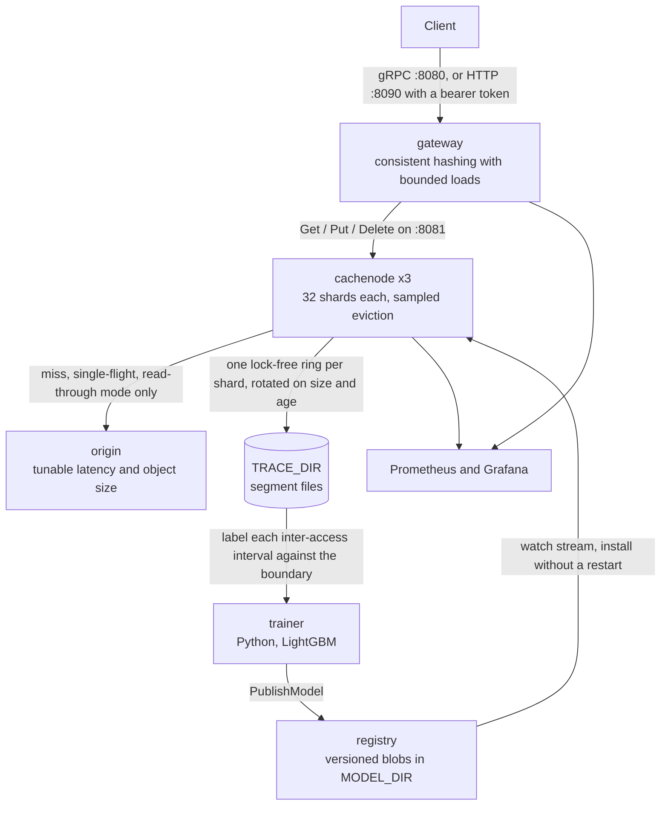

# Belady

A distributed cache whose eviction policy is a machine-learned approximation of the provably optimal algorithm.

Belady's MIN (1966) is the optimal cache eviction policy: evict the object whose next access is furthest in the future.
It is also unimplementable, because it requires seeing the future.
Every production cache therefore falls back on a heuristic, almost always LRU, and stops asking the question.

Belady asks it again.
A gradient-boosted decision tree, trained on sampled access traces, predicts whether an object's next access falls beyond a *Belady boundary*.
Eviction samples a handful of candidates, scores them with that model, and drops the worst.
The technique is [Learned Relaxed Belady](https://www.usenix.org/conference/nsdi20/presentation/song) (NSDI 2020), well known in CDN research and essentially unknown in mainstream backend engineering.

Because the model runs inside the eviction path, it has a hard sub-microsecond budget.
That constraint is the point: it forces flattened cache-friendly tree layouts, sharded locking, zero-allocation request handling, and lock-free trace sampling.

## What it does

The full loop works.
The cluster serves traffic, samples access traces, trains a model from them, publishes it, and the cache nodes install it without a restart.
It runs under Docker Compose with Prometheus and Grafana, and CI covers build, race tests, lint, generated-code drift, vulnerability scanning, and a Compose integration run gated on hit ratio and p99.

There are two serving modes, and a node logs which one it is at startup.
With `ORIGIN_ADDR` set a node is read-through: a miss fetches from origin behind single-flight, admits the result, and returns it.
Without it the node is cache-aside, and a miss is simply not found, leaving the client to decide what to do.

It is not a Redis replacement and does not try to be: no data types beyond bytes, no persistence, no replication, no pub/sub.
What it is is a cache tier, and the small stack around it makes that usable.
The reasoning is written up in [docs/](docs/), including nine decision records, and the open questions are in [ROADMAP.md](ROADMAP.md).

## Tech stack

| Layer | What it uses |
| --- | --- |
| Services | Go 1.26, four binaries under `cmd/` |
| Internal APIs | gRPC and protobuf, contracts in `api/belady/v1/`, stubs committed under `gen/` |
| Trainer | Python 3.11+, LightGBM, numpy |
| Metrics | `prometheus/client_golang`, scraped by Prometheus, dashboards in Grafana |
| Concurrency | `golang.org/x/sync` for single-flight, plus per-shard locks and atomics |
| Deploy | Docker Compose, three stack files under `deploy/` |
| Checks | `go test -race`, golangci-lint with gosec, ruff, pytest, CodeQL, pip-audit |

Four direct Go requires, four Python ones.
`grpcio-tools` and `ruff` are pinned exactly rather than floated, because both produce artefacts CI compares byte for byte and a minor bump would fail the build for no real reason.

## Architecture

| Service | Language | Role |
| --- | --- | --- |
| `gateway` | Go | Client-facing gRPC API, consistent-hash routing, miss coalescing |
| `cachenode` | Go | Sharded store, learned eviction, trace sampling, hot model reload |
| `registry` | Go | Versioned model blobs, streamed to cache nodes |
| `trainer` | Python | Offline labeling and LightGBM training |
| `origin` | Go | Test-fixture backing store |



That cycle is the whole project.
A `Get` hashes to a node through the ring, the node answers from its shard or fetches from origin behind single-flight, and the access is appended to its shard's lock-free ring, which never slows a request: if the ring is full the record is dropped and counted in `belady_cache_trace_dropped_total`.
The trainer reads the rotated segment files offline, labels each sampled interval against the Belady boundary, fits a LightGBM model, and pushes it to the registry, where a watch stream carries it back to every node and the new model takes over eviction mid-flight.
Nothing in that loop is on the request path except the eviction scoring itself, which is why the registry being down means nodes keep evicting with the model they already have rather than failing.

Topology, the request path, where state lives, and the failure table are in [docs/01-architecture.md](docs/01-architecture.md).

## Measured results

Three cache nodes in Docker, 32 shards each, 6 MiB per node, Zipfian s=1.1 over 50,000 keys, 400,000 requests at concurrency 64, 1456-byte mean object, flat 200 µs origin latency, Apple M4 with 8 cores.
Each policy starts cold. The model is a 13-tree LightGBM fit on 80,120 rows sampled from a 13.9 s trace of the same workload, holdout AUC 0.9932, at a 1 s Belady boundary.

| Policy | Object hit | Byte hit | Gap to Belady MIN | Evict cost | p99 | p99.9 |
| --- | --- | --- | --- | --- | --- | --- |
| LRU (sampled, 8) | 0.8636 | 0.8545 | -7.12 pts | 1867 ns/victim | 6.29 ms | 11.88 ms |
| Learned (LRB) | **0.8702** | **0.8608** | **-6.45 pts** | 8343 ns/victim | 5.20 ms | 12.90 ms |

The learned policy wins on hit ratio and closes 9.4% of the remaining gap to optimal.
It also costs 4.5x more per eviction, and that is the more interesting number.

At 0.111 evictions per request, the extra 6.5 µs per eviction works out to roughly 0.72 µs per request spent.
What that buys depends entirely on what a miss costs, and a later sweep of `ORIGIN_LATENCY` from 0 to 20 ms measured it instead of assuming it.
A miss against this same 200 µs origin costs **927 µs at the margin**, not 200 µs, because it also pays gRPC out to the origin and back, a single-flight rendezvous, and queueing behind 63 other in-flight requests.
So the 0.66-point gain saves about 7.4 µs per request, the break-even is **50 to 57 µs of marginal miss cost**, and the cheapest miss this stack can produce still costs 397 µs.
The learned policy is on the paying side everywhere it was measured, by roughly an order of magnitude.

It is also invisible: 7.4 µs against a 1.84 ms p50 is 0.4%, well inside the 17% spread four runs of this configuration showed on a machine where six processes share eight cores.
Throughput is out of the table for that reason.
The two tail columns should be read the same way: the sweep's medians put LRU ahead at p99 at all five origin latencies, the opposite of the row below, so that difference is noise rather than a win.
Read the hit ratio as the interesting result, the eviction cost as the price, and neither as something a client would notice.

[docs/03-performance.md](docs/03-performance.md) has the full method, the exact commands, the origin-latency curve, and what does not reproduce even with a fixed seed.

## What building this taught me

**The Belady boundary is a property of the workload, not a hyperparameter.**
Set it above the reuse times in the trace and everything is labelled "will be reused", set it below and nothing is, and either way the model trains happily and ranks candidates at random.
The trainer now refuses to fit when the labels come out more one-sided than 98/2.

**Where you sample the training row matters more than which model you fit.**
Labelling each access makes `recency_ms` identically zero in every row, while at eviction time it is large and decisive.
Sampling each inter-access interval at a random offset instead made recency the second most informative column, which was worth more than any parameter on the booster.

**A hit-ratio win is not a latency win until you price a miss with a number you measured.**
The first version priced an avoided miss at the configured `ORIGIN_LATENCY`, missing the 730 µs of transport, single-flight rendezvous and queueing a real miss also pays.
That turned "roughly break-even" into a factor of ten, hidden behind an assumption that looked too obvious to check.

## Documentation

- [Architecture](docs/01-architecture.md)
- [Learned eviction: the theory](docs/02-learned-eviction.md)
- [Performance engineering](docs/03-performance.md)
- [gRPC API](docs/04-api.md)
- [Operations](docs/05-operations.md)
- [Security](docs/06-security.md)
- [Architecture decision records](docs/adr/)
- [Roadmap and open questions](ROADMAP.md)
- [Contributing](CONTRIBUTING.md) and [security policy](SECURITY.md)

## License

MIT. See [LICENSE](LICENSE).

## Quick start

Two ways in, depending on whether you want to use the cache or measure it.

### Use it

Two containers, an HTTP API, no origin and no training pipeline.

```sh
export HTTP_AUTH_TOKEN=$(openssl rand -hex 32)
make up-min
```

```sh
curl -H "Authorization: Bearer $HTTP_AUTH_TOKEN" \
     -X PUT --data-binary 'hello' 'localhost:8090/v1/keys/greeting?ttl=5m'
curl -H "Authorization: Bearer $HTTP_AUTH_TOKEN" localhost:8090/v1/keys/greeting
curl -H "Authorization: Bearer $HTTP_AUTH_TOKEN" localhost:8090/v1/stats
```

`GET`, `PUT` and `DELETE` on `/v1/keys/{key}`, plus `GET /v1/stats`.
Keys may contain slashes, `?ttl=` takes a Go duration, and the bearer token is mandatory: the gateway refuses to start with `HTTP_ADDR` set and no token.
The default policy is S3-FIFO, which needs no model and no trainer.

### Measure it

The full stack: five services, three cache nodes, Prometheus, Grafana, and the learned policy.

```sh
cp .env.example .env
make up             # the cluster, Prometheus and Grafana, then wait for health
make bench          # replay a Zipfian workload, report hit ratio and tail latency
make train-compose  # train from the captured trace and publish it
make bench          # again, to see what the model changed
make test           # unit tests with the race detector
```

`make train-compose` rather than `make train`, because with `make up` the traces live in a Compose volume the host cannot see.
Use `make up-dev` if you want them under `./traces`, and see [docs/03-performance.md](docs/03-performance.md) for the exact pass behind the table above.

`make help` lists the rest.
