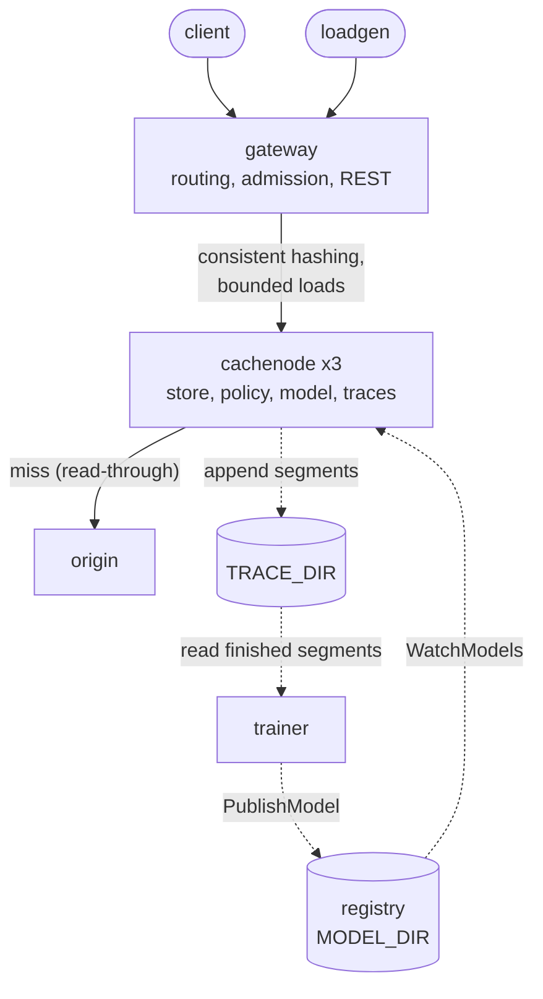
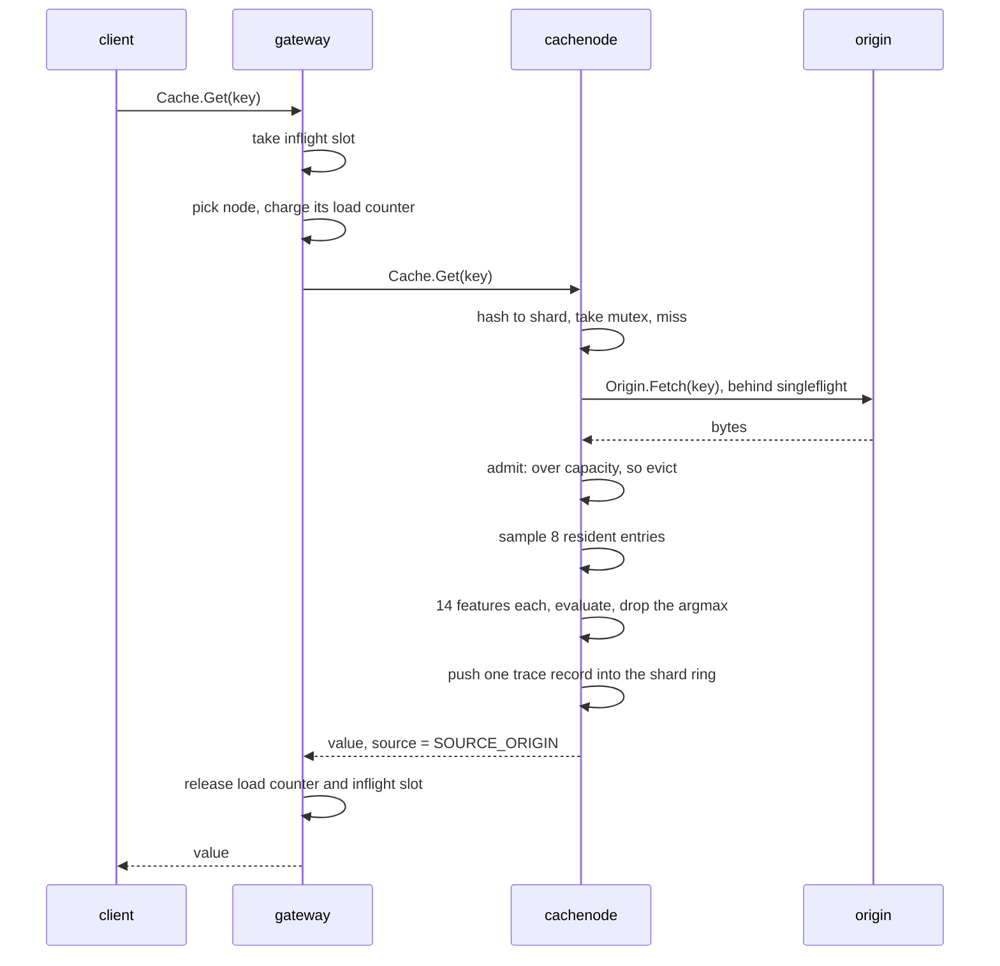

# Architecture

## The shape of it

Five services, all gRPC, plus one measurement binary that is not a service.

| Service | Language | Owns | Listens on |
| --- | --- | --- | --- |
| `gateway` | Go | Routing, concurrency admission, the REST surface | `:8080` gRPC, `:8090` HTTP when enabled |
| `cachenode` | Go | The cache: store, eviction policy, model evaluation, trace sampling | `:8081` gRPC |
| `registry` | Go | Versioned model blobs and a watch stream | `:8082` gRPC |
| `origin` | Go | A backing-store fixture with tunable latency and object sizes | `:8081` gRPC |
| `trainer` | Python | Offline labelling and LightGBM fitting | nothing, it is a batch job |

`loadgen` (`cmd/loadgen`) is a client, not a service.
It generates a workload, replays it, and scores the same trace against Belady's MIN so the result has a ceiling to be compared against.

Every service also serves a debug port, `:9090` by default, carrying `/metrics`, `/healthz` and pprof.

Solid arrows are the request path, dashed arrows are the model and trace paths, which nothing serving depends on.



## The request path

A `Get` for a key that is not cached, in a read-through cluster:

1. The client calls `Cache.Get` on the gateway.
2. The gateway takes a slot from its inflight semaphore, or returns `ResourceExhausted` if the client's deadline expires while queued.
3. It picks a cache node with consistent hashing under bounded loads, charges that node's load counter, and forwards the request unchanged.
4. The cache node hashes the key to a shard, takes that shard's mutex, and misses.
5. The miss goes to `origin` through a `singleflight.Group`, so a thousand concurrent requests for the same cold key produce one origin fetch.
6. The fetched value is admitted, which may evict.
7. Eviction samples a handful of resident entries from the shard's map, builds a fourteen-float feature vector for each, evaluates the gradient-boosted tree, and drops the highest-scoring one.
8. Both the hit and the admission push one record into the shard's lock-free ring, if this key falls in the trace sample.
9. The gateway releases the node's load counter and the inflight slot on the way out.



A hit is steps 1 to 4 and 8, and step 4 also folds the access into the entry's delta history.

The gateway is a routing proxy in front of the same `Cache` service the nodes implement, so a cache node can be exercised directly with the same client and the same tests.

## Where state lives

| State | Where | Survives a restart |
| --- | --- | --- |
| Cached objects | Cache node process memory | No, and it is not meant to |
| Entry metadata: access history, admission time, size, frequency | Alongside each object in the same struct | No |
| The trained model | `registry`, as files in `MODEL_DIR` | Yes, on a volume |
| Access traces | Cache node disk, `TRACE_DIR`, as rotated segment files | Yes, on a volume |
| Routing topology | Gateway process memory, built from `CACHE_NODES` at startup | Rebuilt from config |
| Node load counters | Gateway process memory, atomics | No, and they are only meaningful live |

Nothing in the request path writes to a database, and nothing outside the registry and the trace directory writes to disk at all.
A cache node is disposable by construction: losing one loses cached bytes and the traces not yet rotated, and the ring's replicas absorb the keyspace it was holding.

## Why the boundaries fall where they do

**The gateway holds no cache.**
It exists for the two things that are genuinely global: which node owns a key, and how much concurrent work the cluster is allowed to have in flight.
Putting a cache in the gateway would create a second tier with its own hit ratio, and every eviction-policy comparison after that would be measuring the wrong thing.

**Miss coalescing is in the cache node, not the gateway.**
Single-flight has to be keyed by whatever owns the object, and that is the shard on the node.
Coalescing at the gateway would collapse requests that were going to different nodes anyway, and would still let two nodes fetch the same key when bounded loads spilled it.

**The trainer is a separate process in a separate language.**
LightGBM's training path is a C++ library with a Python interface, and nothing about fitting a model wants to live inside a server that is holding a shard lock a hundred thousand times a second.
The split is [ADR 0001](adr/0001-go-services-python-trainer.md); the contract between the two sides is one file on each side, `internal/features/features.go` and `trainer/belady_trainer/columns.py`, kept honest by a Go test that parses the Python.

**The registry is a directory of files with a gRPC face.**
A model is a few hundred kilobytes published a few times a day.
The interesting properties are that a half-written model can never be served, that a node restarting converges without waiting for the next training run, and that a bad model can be named afterwards.
None of those want a database.

**Traces are files the trainer reads, not a stream the trainer receives.**
A gRPC stream would make the trainer a dependency of the cache node's write path, which is exactly backwards: the trainer is an offline job that may not be running at all.
Segment files decouple them completely, and a segment becomes visible by atomic rename, so a reader can never see a partial one.
That is [ADR 0004](adr/0004-trace-capture-via-segment-files.md).

**Every service reads configuration from the environment only.**
No config files means an image can never carry a secret, and `internal/config` exits with status 2 on a missing required value while warning and falling back on a malformed tuning knob.
A typo in `CACHE_SHARDS` must not take a node out of rotation; a missing `CACHE_NODES` must.

## The two serving modes

A cache node with `ORIGIN_ADDR` set is **read-through**.
A miss fetches from origin behind single-flight, admits the result, and returns it with `source = SOURCE_ORIGIN`.

A cache node without `ORIGIN_ADDR` is **cache-aside**.
A miss is simply `found = false`, and the client decides what to do about it.
This is what the two-container `make up-min` stack runs, and it is why `ORIGIN_ADDR` has no default: an unset origin is a deployment choice rather than a misconfiguration.

The node logs which mode it is in at startup.
Everything else about the two modes is identical, including the policy, the trace sampling and the metrics.

## The model rollout path

```
trainer ──PublishModel(stream)──▶ registry ──WatchModels(stream)──▶ cachenode
                                     │                                  │
                                     └────GetModel(stream)──────────────┘
```

The trainer streams metadata then chunks.
The registry validates the digest, the declared size, the feature count and a non-zero boundary before anything lands, writes the model file, renames it into place, and only then writes the metadata file that readers look for.

Each cache node runs a `registry.Watcher` off the request path.
It watches with `since_version` set to the version it already has, so a reconnect does not re-download and a restarted node is caught up immediately.
On an event it fetches, re-validates the digest against the bytes that actually arrived, parses the LightGBM text dump into flat arrays, and stores the result with one atomic pointer write.
An eviction happening during that write finishes against the old model rather than waiting.

A model is refused, loudly and without breaking the watch, when its format is not `lightgbm-text`, when its feature count disagrees with this build's layout, or when its Belady boundary disagrees with this node's `MODEL_BOUNDARY`.
That last check is the subtle one, and [02-learned-eviction.md](02-learned-eviction.md) explains why a boundary mismatch is undetectable downstream.

## Failure behaviour

| What breaks | What happens |
| --- | --- |
| A cache node dies | The gateway's calls to it fail; the ring still lists it until the process is reconfigured. Keys it held become misses. |
| The registry is down | Nodes keep evicting with the model they already have, or with sampled LRU if they never got one. The watcher retries with backoff from 1s to 30s. |
| Origin is down | Misses return an error to the client. Hits are unaffected, because the cache node never consults origin for a resident key. |
| The trainer fails | Nothing serving changes. A degenerate label distribution is a refusal to fit, not a bad model published. |
| A trace ring fills up | Records are dropped and counted in `belady_cache_trace_dropped_total`. No request is ever slowed to make room. |
| The trace directory is unwritable | The recorder probes at startup and logs a failure once, rather than failing a request. |
| A handler panics | The gRPC interceptor recovers it, increments `belady_rpc_panics_total`, and returns `Internal`. |

The rule behind all of these: the request path depends on the cache node and, in read-through mode, on origin.
It does not depend on the registry, the trainer, the trace directory or Prometheus, and each of those is arranged so that its absence is a logged warning rather than a served error.
